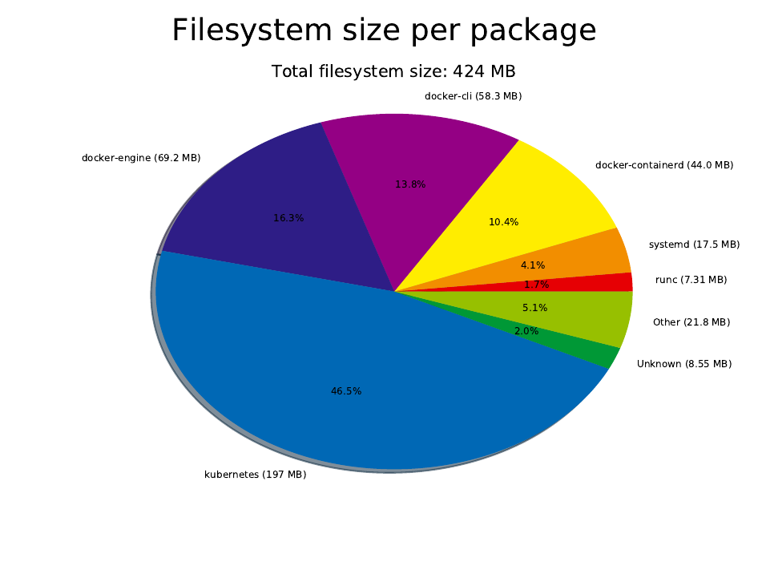
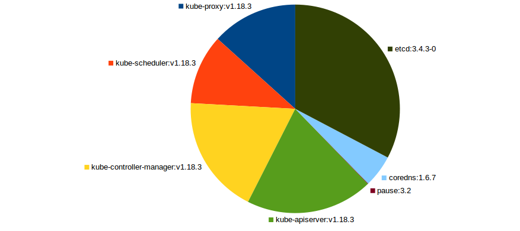

buildroot4kubernetes
====================

Build a minimal environment with Buildroot, enough for running kubeadm for Kubernetes.

So basically the "bigger brother" of boot2docker... Or a smaller version of minikube.iso.

Written by Anders Björklund (@afbjorklund)


Kernel
* namespaces
* cgroups
* overlayfs
* nat
* bridge
* conntrack
* vxlan

User
* systemd
* glibc (required by systemd)
* docker
* containerd (required by dockerd)
* bash
* iptables
* conntrack (required since 1.18)




Bootable image:

```
155M	output/disk.img.gz
```

Kubernetes bin:

```
43M     kubeadm
45M     kubectl
113M    kubelet
```

Required images:

```console
$ kubeadm config images list
k8s.gcr.io/kube-apiserver:v1.23.0
k8s.gcr.io/kube-controller-manager:v1.23.0
k8s.gcr.io/kube-scheduler:v1.23.0
k8s.gcr.io/kube-proxy:v1.23.0
k8s.gcr.io/pause:3.6
k8s.gcr.io/etcd:3.5.1-0
k8s.gcr.io/coredns/coredns:v1.8.6
```

`docker images`:

```
REPOSITORY                           TAG        IMAGE ID       CREATED         SIZE
k8s.gcr.io/kube-apiserver            v1.23.0    e6bf5ddd4098   2 weeks ago     135MB
k8s.gcr.io/kube-controller-manager   v1.23.0    37c6aeb3663b   2 weeks ago     125MB
k8s.gcr.io/kube-scheduler            v1.23.0    56c5af1d00b5   2 weeks ago     53.5MB
k8s.gcr.io/kube-proxy                v1.23.0    e03484a90585   2 weeks ago     112MB
k8s.gcr.io/pause                     3.6        6270bb605e12   4 months ago    683kB
k8s.gcr.io/etcd                      3.5.1-0    25f8c7f3da61   7 weeks ago     293MB
k8s.gcr.io/coredns/coredns           v1.8.6     a4ca41631cc7   2 months ago    46.8MB
```



`docker pull` (gzip):

```
31M	images/k8s.gcr.io/kube-apiserver_v1.23.0
29M	images/k8s.gcr.io/kube-controller-manager_v1.23.0
15M	images/k8s.gcr.io/kube-scheduler_v1.23.0
37M	images/k8s.gcr.io/kube-proxy_v1.23.0
284K	images/k8s.gcr.io/pause_3.6
94M	images/k8s.gcr.io/etcd_3.5.1-0
13M	images/k8s.gcr.io/coredns/coredns_v1.8.6
20M	images/quay.io/coreos/flannel_v0.14.0
237M	total
```

`docker save | xz`:

```
162M	images.txz
```

```
Strms  Blocks   Compressed Uncompressed  Ratio  Check   Filename
    1      51    161,5 MiB    789,9 MiB  0,204  CRC32   images.txz
```

Device layout:

| QEMU | File          | Media | Device   | Used for          | Size |
| ---- | ------------- | ----- | -------- | ----------------- | ---- |
| -hda | disk.img      | disk  | /dev/sda | Persistent `/var` |  20g |
| -hdb | data.img      | disk  | /dev/sdb | Persistent `/data`|   5g |
| -hdc | buildroot.iso | cdrom |          | Buildroot booting | 137m |
| -hdd | images.iso    | cdrom | /dev/sdc | Kubernetes images | 160m |

Reference board:

`pc` (bios)

```
4.9M	output/images/bzImage
84M	output/images/rootfs.ext2
```
