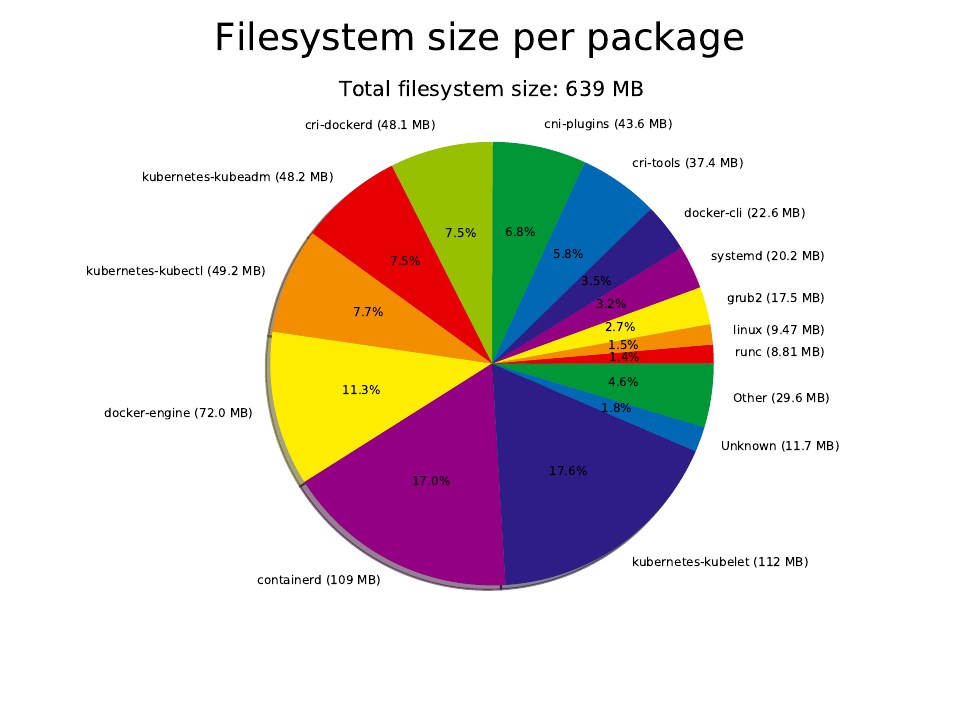
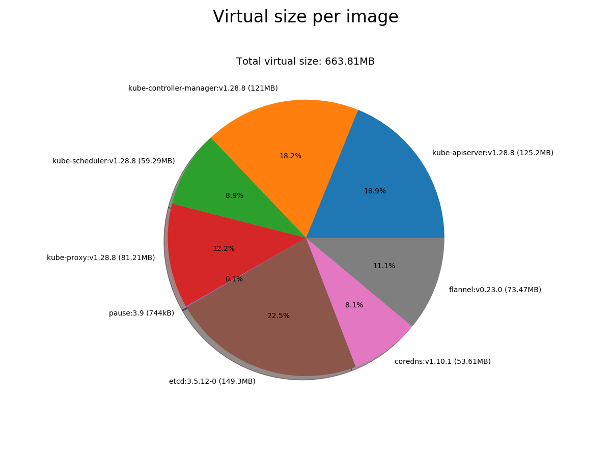

buildroot4kubernetes
====================

Build a minimal environment with Buildroot, enough for running kubeadm for Kubernetes.

So basically the "bigger brother" of boot2docker... Or a smaller version of minikube.iso.

Written by Anders Björklund (@afbjorklund)


Kernel
* namespaces
* cgroups
* overlayfs
* nat
* bridge
* conntrack
* vxlan

User
* systemd
* glibc (required by systemd)
* docker
* containerd (required by dockerd)
* bash
* iptables
* conntrack (required since 1.18)




Bootable image:

```
143M	output/disk.img.gz
```

Kubernetes bin:

```
38M     kubeadm
42M     kubectl
109M    kubelet
```

Required images:

```console
$ kubeadm config images list
k8s.gcr.io/kube-apiserver:v1.18.5
k8s.gcr.io/kube-controller-manager:v1.18.5
k8s.gcr.io/kube-scheduler:v1.18.5
k8s.gcr.io/kube-proxy:v1.18.5
k8s.gcr.io/pause:3.2
k8s.gcr.io/etcd:3.4.3-0
k8s.gcr.io/coredns:1.6.7
```

`docker images`:

```
REPOSITORY                           TAG                 IMAGE ID            CREATED             SIZE
k8s.gcr.io/kube-proxy                v1.18.5             a1daed4e2b60        2 weeks ago         117MB
k8s.gcr.io/kube-controller-manager   v1.18.5             8d69eaf196dc        2 weeks ago         162MB
k8s.gcr.io/kube-apiserver            v1.18.5             08ca24f16874        2 weeks ago         173MB
k8s.gcr.io/kube-scheduler            v1.18.5             39d887c6621d        2 weeks ago         95.3MB
k8s.gcr.io/pause                     3.2                 80d28bedfe5d        4 months ago        683kB
k8s.gcr.io/coredns                   1.6.7               67da37a9a360        5 months ago        43.8MB
k8s.gcr.io/etcd                      3.4.3-0             303ce5db0e90        8 months ago        288MB
quay.io/coreos/flannel               v0.12.0-amd64       4e9f801d2217        3 months ago        52.8MB
```



`docker pull` (gzip):

```
16M	images/quay.io/coreos/flannel_v0.12.0-amd64
284K	images/k8s.gcr.io/pause_3.2
95M	images/k8s.gcr.io/etcd_3.4.3-0
48M	images/k8s.gcr.io/kube-apiserver_v1.18.5
47M	images/k8s.gcr.io/kube-proxy_v1.18.5
46M	images/k8s.gcr.io/kube-controller-manager_v1.18.5
13M	images/k8s.gcr.io/coredns_1.6.7
32M	images/k8s.gcr.io/kube-scheduler_v1.18.5
296M	total
```

`docker save | xz`:

```
167M	images.txz
```

```
Strms  Blocks   Compressed Uncompressed  Ratio  Check   Filename
    1      48    166.5 MiB    745.0 MiB  0.224  CRC32   images.txz
```

Device layout:

| QEMU | File          | Media | Device   | Used for          | Size |
| ---- | ------------- | ----- | -------- | ----------------- | ---- |
| -hda | disk.img      | disk  | /dev/sda | Persistent `/var` |  20g |
| -hdb | data.img      | disk  | /dev/sdb | Persistent `/data`|   5g |
| -hdc | buildroot.iso | cdrom |          | Buildroot booting | 143m |
| -hdd | images.iso    | cdrom | /dev/sdc | Kubernetes images | 167m |

Reference board:

`pc` (bios)

```
4.9M	output/images/bzImage
84M	output/images/rootfs.ext2
```
